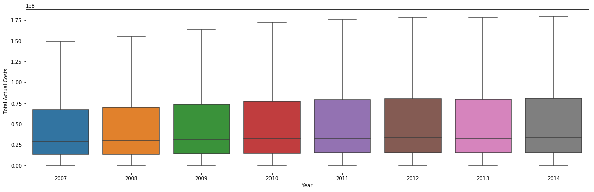
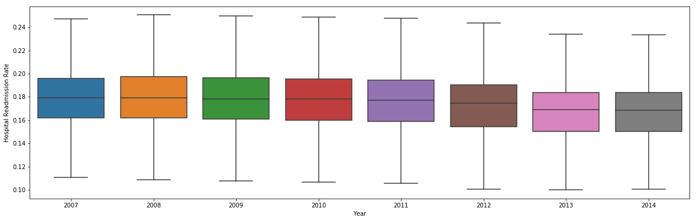

# County-Medicare-Spending

Each year see an gradual increase in total average costs.

The hospital readmission rate is decreasing each year.

This plot shows a comparisson of the R2 score and MSE for each model.  R2 = 0.994918 and MSE = 0.00939335

